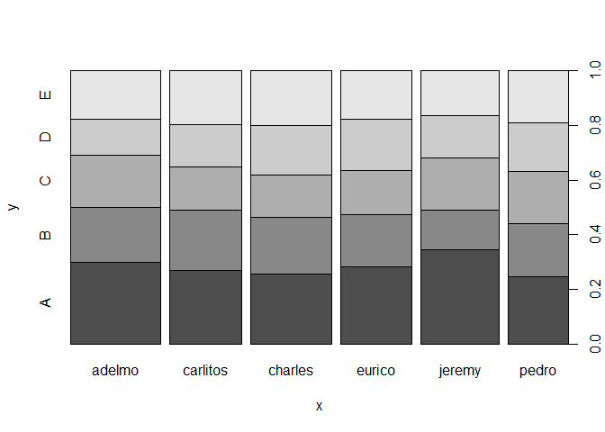

## Introduction

The goal of this project is to create a machine learning model and predict the manner in which a few people did Weight Lifting Exercise. The output variable is "Classe". 

The training data for this project are available here:

https://d396qusza40orc.cloudfront.net/predmachlearn/pml-training.csv

The test data are available here:

https://d396qusza40orc.cloudfront.net/predmachlearn/pml-testing.csv

## Load data
Let's load libraries and datasets already downloaded on local path

```r
suppressMessages(library(dplyr))
suppressMessages(library(ggplot2))
suppressMessages(library(caret))
#if (!file.exists("pml-training.csv")) setwd('C:/POC/Git/Practical_ML_PeerAssessment1') #setting according to user environment
dftrain_orig <- read.table("pml-training.csv", sep=',',quote='"', header = TRUE)
dftest_orig <- read.table("pml-testing.csv", sep=',',quote='"', header = TRUE)
```


### Good Columns Identification

Let's check the near zero variance on columns and remove the columns. They might cause issues on training the models.

```r
nsv <- nearZeroVar(dftrain_orig[,names(dftrain_orig) != 'classe'],saveMetrics=TRUE)
nsv[nsv$nzv == TRUE,]
```

```
##                          freqRatio percentUnique zeroVar  nzv
## new_window                47.33005    0.01019264   FALSE TRUE
## kurtosis_roll_belt      1921.60000    2.02323922   FALSE TRUE
## kurtosis_picth_belt      600.50000    1.61553358   FALSE TRUE
## kurtosis_yaw_belt         47.33005    0.01019264   FALSE TRUE
## skewness_roll_belt      2135.11111    2.01304658   FALSE TRUE
## skewness_roll_belt.1     600.50000    1.72255631   FALSE TRUE
## skewness_yaw_belt         47.33005    0.01019264   FALSE TRUE
## max_yaw_belt             640.53333    0.34654979   FALSE TRUE
## min_yaw_belt             640.53333    0.34654979   FALSE TRUE
## amplitude_yaw_belt        50.04167    0.02038528   FALSE TRUE
## avg_roll_arm              77.00000    1.68178575   FALSE TRUE
## stddev_roll_arm           77.00000    1.68178575   FALSE TRUE
## var_roll_arm              77.00000    1.68178575   FALSE TRUE
## avg_pitch_arm             77.00000    1.68178575   FALSE TRUE
## stddev_pitch_arm          77.00000    1.68178575   FALSE TRUE
## var_pitch_arm             77.00000    1.68178575   FALSE TRUE
## avg_yaw_arm               77.00000    1.68178575   FALSE TRUE
## stddev_yaw_arm            80.00000    1.66649679   FALSE TRUE
## var_yaw_arm               80.00000    1.66649679   FALSE TRUE
## kurtosis_roll_arm        246.35897    1.68178575   FALSE TRUE
## kurtosis_picth_arm       240.20000    1.67159311   FALSE TRUE
## kurtosis_yaw_arm        1746.90909    2.01304658   FALSE TRUE
## skewness_roll_arm        249.55844    1.68688207   FALSE TRUE
## skewness_pitch_arm       240.20000    1.67159311   FALSE TRUE
## skewness_yaw_arm        1746.90909    2.01304658   FALSE TRUE
## max_roll_arm              25.66667    1.47793293   FALSE TRUE
## min_roll_arm              19.25000    1.41677709   FALSE TRUE
## min_pitch_arm             19.25000    1.47793293   FALSE TRUE
## amplitude_roll_arm        25.66667    1.55947406   FALSE TRUE
## amplitude_pitch_arm       20.00000    1.49831821   FALSE TRUE
## kurtosis_roll_dumbbell  3843.20000    2.02833554   FALSE TRUE
## kurtosis_picth_dumbbell 9608.00000    2.04362450   FALSE TRUE
## kurtosis_yaw_dumbbell     47.33005    0.01019264   FALSE TRUE
## skewness_roll_dumbbell  4804.00000    2.04362450   FALSE TRUE
## skewness_pitch_dumbbell 9608.00000    2.04872082   FALSE TRUE
## skewness_yaw_dumbbell     47.33005    0.01019264   FALSE TRUE
## max_yaw_dumbbell         960.80000    0.37203139   FALSE TRUE
## min_yaw_dumbbell         960.80000    0.37203139   FALSE TRUE
## amplitude_yaw_dumbbell    47.92020    0.01528896   FALSE TRUE
## kurtosis_roll_forearm    228.76190    1.64101519   FALSE TRUE
## kurtosis_picth_forearm   226.07059    1.64611151   FALSE TRUE
## kurtosis_yaw_forearm      47.33005    0.01019264   FALSE TRUE
## skewness_roll_forearm    231.51807    1.64611151   FALSE TRUE
## skewness_pitch_forearm   226.07059    1.62572623   FALSE TRUE
## skewness_yaw_forearm      47.33005    0.01019264   FALSE TRUE
## max_roll_forearm          27.66667    1.38110284   FALSE TRUE
## max_yaw_forearm          228.76190    0.22933442   FALSE TRUE
## min_roll_forearm          27.66667    1.37091020   FALSE TRUE
## min_yaw_forearm          228.76190    0.22933442   FALSE TRUE
## amplitude_roll_forearm    20.75000    1.49322189   FALSE TRUE
## amplitude_yaw_forearm     59.67702    0.01528896   FALSE TRUE
## avg_roll_forearm          27.66667    1.64101519   FALSE TRUE
## stddev_roll_forearm       87.00000    1.63082255   FALSE TRUE
## var_roll_forearm          87.00000    1.63082255   FALSE TRUE
## avg_pitch_forearm         83.00000    1.65120783   FALSE TRUE
## stddev_pitch_forearm      41.50000    1.64611151   FALSE TRUE
## var_pitch_forearm         83.00000    1.65120783   FALSE TRUE
## avg_yaw_forearm           83.00000    1.65120783   FALSE TRUE
## stddev_yaw_forearm        85.00000    1.64101519   FALSE TRUE
## var_yaw_forearm           85.00000    1.64101519   FALSE TRUE
```

Selecting only the good columns 

```r
df0 <- dftrain_orig %>% 
  select(num_window:total_accel_belt, gyros_belt_x:total_accel_arm, gyros_arm_x:magnet_arm_z, roll_dumbbell:yaw_dumbbell, total_accel_dumbbell, gyros_dumbbell_x:yaw_forearm, total_accel_forearm, gyros_forearm_x:magnet_forearm_z, classe)

columns <- names(df0)
columns <- columns[! columns %in% c('classe')]

dftest20samples <- dftest_orig %>%
  select(columns)
```

Checking nearZeroVar again

```r
nsv <- nearZeroVar(df0[,names(df0) != 'classe'],saveMetrics=TRUE)
nsv[nsv$nzv == TRUE,]
```

```
## [1] freqRatio     percentUnique zeroVar       nzv          
## <0 rows> (or 0-length row.names)
```
The results of nearZeroVar function applied to df0 confirm that we removed bad columns.

## Data spliting
Let's use 80% of data for training the model and 20% of data to calculate the expected out of sample error

```r
set.seed(12)
train_index = createDataPartition(df0$classe, p=0.8, list = FALSE)
df_train <- df0[train_index,]
df_test <- df0[-train_index,]
```


## Exploratory analysis

Simple plot to check the distribution

<!-- -->


## Model 
Let's use trainControl function to setup Cross Validation (CV). The preProcess funtion will center, scale and fill empty models before training the model. For simplicity, we can compare just 2 models

```r
#cvCtrl <- trainControl(method = "repeatedcv", repeats = 3)
#cvCtrl <- trainControl(method = "cv")
cvCtrl <- trainControl(method = "cv",
                       number = 5 ,
                       verboseIter = FALSE
                       )
set.seed(12)
model1 <- train(classe ~ ., data = df_train,
                preProcess=c("center","scale","knnImpute"),
                method = "rpart",
                tuneLength = 30,
                trControl = cvCtrl,
                na.action = na.pass)

set.seed(12)
model2 <- train(classe ~ ., data = df_train,
                preProcess=c("center","scale","knnImpute"),
                method = "svmLinear",
                tuneLength = 10,
                trControl = cvCtrl,
                na.action = na.pass)

set.seed(12)
model3 <- train(classe ~ ., data = df_train, 
                 preProcess=c("center","scale","knnImpute"),
                 method = "gbm", 
                 trControl = cvCtrl,
                 ## This last option is actually one
                 ## for gbm() that passes through
                 verbose = FALSE)
```
## Prediction
Model 1 Results

```r
pred1 <- predict(model1, newdata = df_test)
cf1 <- confusionMatrix(df_test$classe, pred1)
cf1
```

```
## Confusion Matrix and Statistics
## 
##           Reference
## Prediction    A    B    C    D    E
##          A 1037   31   14   30    4
##          B   86  572   61   13   27
##          C    9   53  560   42   20
##          D   53   35   34  508   13
##          E   13   24   40   54  590
## 
## Overall Statistics
##                                           
##                Accuracy : 0.8328          
##                  95% CI : (0.8207, 0.8443)
##     No Information Rate : 0.3054          
##     P-Value [Acc > NIR] : < 2.2e-16       
##                                           
##                   Kappa : 0.788           
##  Mcnemar's Test P-Value : 2.55e-13        
## 
## Statistics by Class:
## 
##                      Class: A Class: B Class: C Class: D Class: E
## Sensitivity            0.8656   0.8000   0.7898   0.7852   0.9021
## Specificity            0.9710   0.9417   0.9614   0.9588   0.9599
## Pos Pred Value         0.9292   0.7536   0.8187   0.7900   0.8183
## Neg Pred Value         0.9426   0.9548   0.9540   0.9576   0.9800
## Prevalence             0.3054   0.1823   0.1807   0.1649   0.1667
## Detection Rate         0.2643   0.1458   0.1427   0.1295   0.1504
## Detection Prevalence   0.2845   0.1935   0.1744   0.1639   0.1838
## Balanced Accuracy      0.9183   0.8709   0.8756   0.8720   0.9310
```

Note that the `echo = FALSE` parameter was added to the code chunk to prevent printing of the R code that generated the plot.

Model 2 Results

```r
pred2 <- predict(model2, newdata = df_test)
cf2 <- confusionMatrix(df_test$classe, pred2)
cf2
```

```
## Confusion Matrix and Statistics
## 
##           Reference
## Prediction    A    B    C    D    E
##          A 1026   31   18   35    6
##          B   87  557   50   10   55
##          C   55   51  546   15   17
##          D   40   26   77  473   27
##          E   49   79   43   40  510
## 
## Overall Statistics
##                                           
##                Accuracy : 0.7933          
##                  95% CI : (0.7803, 0.8058)
##     No Information Rate : 0.3204          
##     P-Value [Acc > NIR] : < 2.2e-16       
##                                           
##                   Kappa : 0.7372          
##  Mcnemar's Test P-Value : < 2.2e-16       
## 
## Statistics by Class:
## 
##                      Class: A Class: B Class: C Class: D Class: E
## Sensitivity            0.8162   0.7487   0.7439   0.8255   0.8293
## Specificity            0.9662   0.9365   0.9567   0.9493   0.9362
## Pos Pred Value         0.9194   0.7339   0.7982   0.7356   0.7074
## Neg Pred Value         0.9177   0.9409   0.9420   0.9695   0.9672
## Prevalence             0.3204   0.1897   0.1871   0.1461   0.1568
## Detection Rate         0.2615   0.1420   0.1392   0.1206   0.1300
## Detection Prevalence   0.2845   0.1935   0.1744   0.1639   0.1838
## Balanced Accuracy      0.8912   0.8426   0.8503   0.8874   0.8827
```

Model 3 Results

```r
pred3 <- predict(model3, newdata = df_test)
cf3 <- confusionMatrix(df_test$classe, pred3)
cf3
```

```
## Confusion Matrix and Statistics
## 
##           Reference
## Prediction    A    B    C    D    E
##          A 1113    3    0    0    0
##          B    6  745    7    1    0
##          C    0    6  673    4    1
##          D    0    4    9  629    1
##          E    0    1    1    4  715
## 
## Overall Statistics
##                                          
##                Accuracy : 0.9878         
##                  95% CI : (0.9838, 0.991)
##     No Information Rate : 0.2852         
##     P-Value [Acc > NIR] : < 2.2e-16      
##                                          
##                   Kappa : 0.9845         
##  Mcnemar's Test P-Value : NA             
## 
## Statistics by Class:
## 
##                      Class: A Class: B Class: C Class: D Class: E
## Sensitivity            0.9946   0.9816   0.9754   0.9859   0.9972
## Specificity            0.9989   0.9956   0.9966   0.9957   0.9981
## Pos Pred Value         0.9973   0.9816   0.9839   0.9782   0.9917
## Neg Pred Value         0.9979   0.9956   0.9948   0.9973   0.9994
## Prevalence             0.2852   0.1935   0.1759   0.1626   0.1828
## Detection Rate         0.2837   0.1899   0.1716   0.1603   0.1823
## Detection Prevalence   0.2845   0.1935   0.1744   0.1639   0.1838
## Balanced Accuracy      0.9968   0.9886   0.9860   0.9908   0.9977
```


## Conclusion
Model 3 shows the best Expected Accuracy, around 98% on testing data (20% split).
Let's use the Model 3 to predict the 20 samples in dftest20samples.


```r
predict20 <- predict(model3, newdata = dftest20samples)
data.frame(sample=1:20,classe=predict20)
```

```
##    sample classe
## 1       1      B
## 2       2      A
## 3       3      B
## 4       4      A
## 5       5      A
## 6       6      E
## 7       7      D
## 8       8      B
## 9       9      A
## 10     10      A
## 11     11      B
## 12     12      C
## 13     13      B
## 14     14      A
## 15     15      E
## 16     16      E
## 17     17      A
## 18     18      B
## 19     19      B
## 20     20      B
```

#
